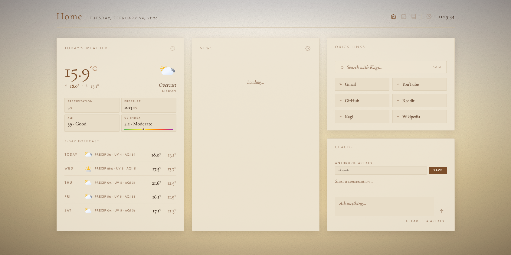
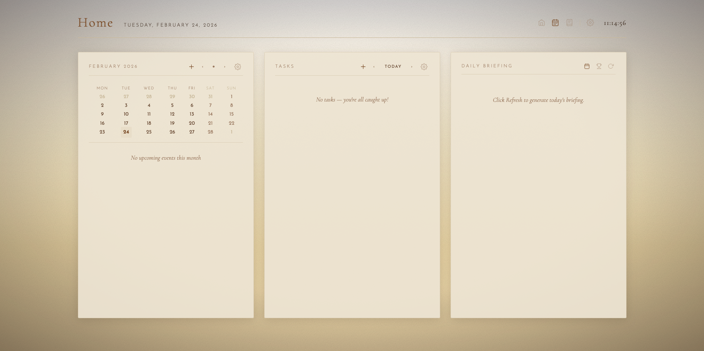
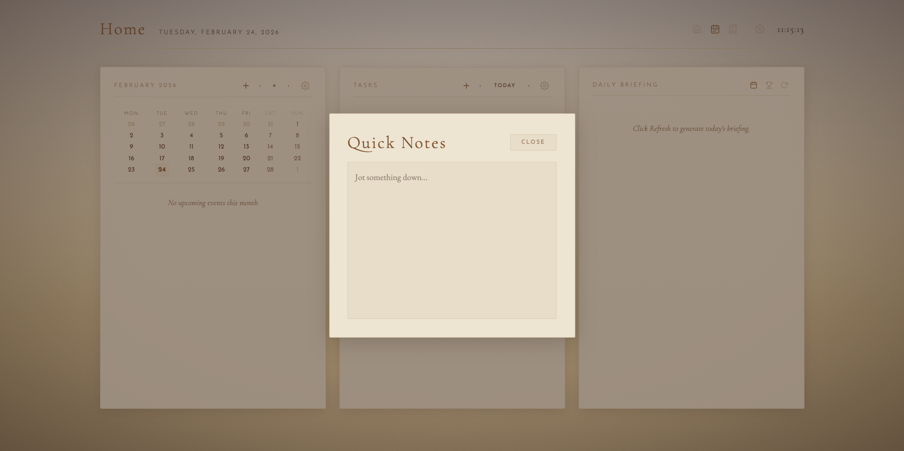

# Home — Personal Dashboard

A minimal, elegant personal startpage built entirely by [Claude](https://claude.ai) (Anthropic) through iterative conversations with Barros. Every line of HTML, CSS, and JavaScript was written by Claude based on Barros's requirements and feedback — no templates, no frameworks, no manual coding.

## Screenshots

### Home
Weather, RSS feeds, quick links, and embedded Claude chat.

### Calendar
Monthly calendar with CalDAV events, Todoist tasks, AI-generated daily briefing (weather, events, and tasks), and sports briefing.

### Notes
Quick notes scratchpad accessible from the header.

## What it does

**Home** is a single-page dashboard designed to be a browser start page, combining daily essentials into one clean interface:

- **Quick Links** — bookmarks organised by category, editable in place
- **RSS Feeds** — aggregated news from configured sources, fetched via proxy
- **Calendar** — monthly view with events pulled from CalDAV (Fastmail) and ICS feeds; click any day in the mini-calendar to filter events for that date
- **Todoist Integration** — tasks with three views (Today, Upcoming, All Tasks), full task editing (title, description, priority, due date, labels), task notes and comments with Markdown rendering, and delete support
- **Weather** — current conditions and 5-day forecast via Open-Meteo, with precipitation, pressure, AQI (European), and UV Index with colour bar; auto-refreshes every 30 minutes
- **Daily Briefing** — AI-generated morning/afternoon/evening summary of your calendar, tasks, and weather, powered by Claude Sonnet 4; automatically regenerates when the time period changes
- **Sports Briefing** — AI-generated overview of upcoming matches from 17+ ICS sports calendar feeds (Formula 1, Champions League, Europa League, Premier League, and more)
- **CalDAV Event Editing** — create, edit, and delete CalDAV events directly from the calendar; supports recurring events (edit full series with RRULE/EXDATE preservation)
- **Quick Notes** — simple scratchpad accessible from the header
- **Claude Chat** — embedded assistant for quick questions
- **Settings Export/Import** — backup and restore all settings with a dated JSON file

## Architecture

The application is split into two parts:

| Component | Hosted on | Purpose |
|-----------|-----------|---------|
| `index.html` + `app.js` | GitHub Pages (`home.barros.work`) | UI, all client-side logic |
| `worker.js` | Cloudflare Worker (`api.barros.work`) | Auth, CORS proxy, API relay (Claude, Todoist, CalDAV), KV settings storage |

All user settings (links, feeds, API keys, calendars) are stored in Cloudflare Workers KV, synced automatically across devices via a unique token.

## Authentication

The site is protected by token-based authentication. The Worker validates credentials against encrypted secrets and issues a signed HMAC-SHA256 token (30-day expiry) stored as a cookie. All Worker routes require a valid token — the static HTML is public, but without authentication no data or API calls are accessible.

## Design

The visual style is intentionally warm and typographic — no bright colours, no harsh contrasts. The palette is built around cream, sand, and brown tones with a multi-stop gradient background and subtle paper noise texture.

Typography uses two fonts throughout:

- **Raleway** (200/300/400/500) — labels, headers, buttons, weather data, calendar times, UI elements
- **Cormorant Garamond** (300/400/500/600, italic) — body text, briefing content, notes, event titles

## Built with Claude

This project was developed entirely through conversation. Barros described what he wanted; Claude wrote the code. Every feature, every bug fix, every design decision went through this loop — describe, generate, test, refine. The current version (5.7) is the result of dozens of iterative sessions spanning multiple days.

No code was written by hand.

## Self-Hosting

Want to deploy your own instance? Follow the [step-by-step guide](HOWTO.md) — it covers domain setup, Cloudflare Worker configuration, GitHub Pages deployment, and everything in between. No coding knowledge required.
